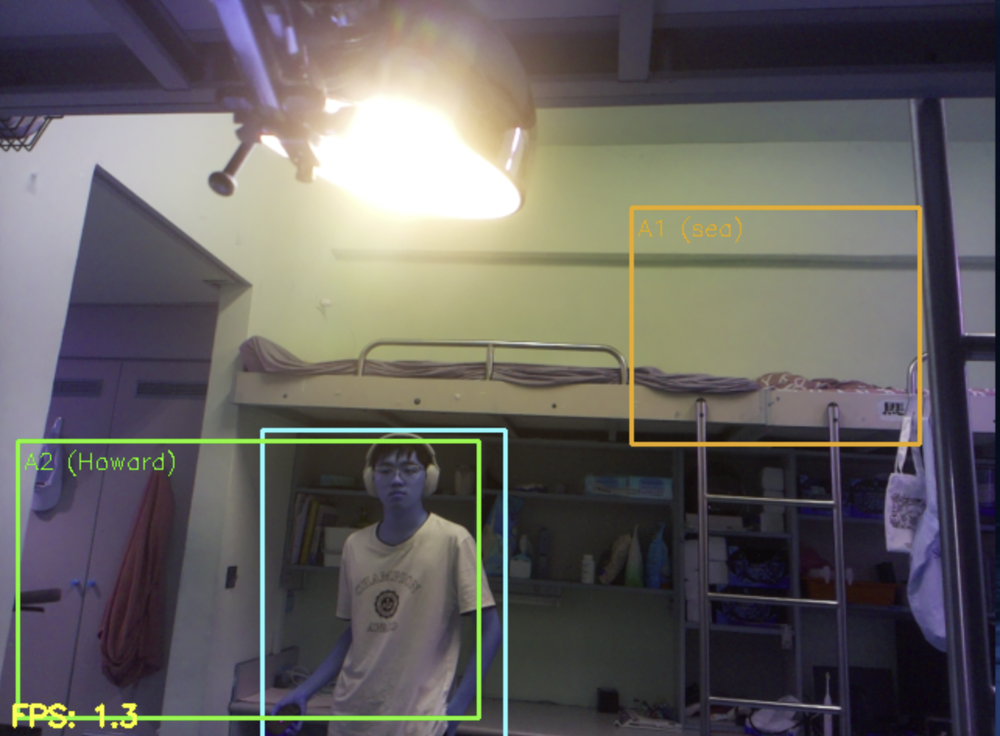
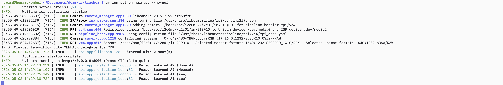

# dorm-ac-tracker

Raspberry Pi 鏡頭 + YOLO，偵測宿舍座位是否有人，並記錄進出時間。

---

## 架構

```
hal/          硬體抽象（Picamera2）
drivers/      裝置語意封裝（FrameSource）
inference/    TFLite YOLO 推論
services/     座位偵測邏輯（SeatDetectionService）
api/          FastAPI — 網頁設定、Snapshot、SQLite 寫入
config.py     pydantic-settings，讀 config.toml
```

資料流：`PiCamera → FrameSource → YoloDetector → SeatDetectionService → occupancy_log`

---

## 安裝

需要 Python 3.11+，以及 Picamera2（系統安裝）。

```bash
make
```

---

## 設定

編輯 `config.toml`：

```toml
[model]
path = "models/yolo26n_float32.tflite"
conf_threshold = 0.45
nms_threshold = 0.5

[zone]          # 暫時保留，目前座位從網頁設定
x1 = 0
y1 = 0
x2 = 320
y2 = 480
```

---

## 執行

```bash
# 有桌面環境（顯示 OpenCV 視窗）
uv run python main.py

# SSH / Headless
uv run python main.py --no-gui
```

啟動後開啟瀏覽器：`http://<pi-ip>:8000`

---

## ROI 設定頁面



1. 點 **Refresh Snapshot** 載入當前畫面
2. 在 canvas 上拖曳框出座位區域
3. 輸入 `seat_id` 和 `user_name`
4. 點 **Save** 存入 SQLite
5. 點 **Reload Seats** 讓偵測系統立即套用新設定（不需重啟）

---

## 偵測 Log

進出每個座位都會寫進 `occupancy_log` table，同時印在 terminal：



---

## 技術

| 類別 | 項目 |
|------|------|
| 硬體 | Raspberry Pi + Camera Module（Picamera2 / libcamera） |
| 推論 | YOLOv2.6 / YOLOv8 TFLite（`tflite-runtime` / `ai_edge_litert`） |
| 影像處理 | OpenCV（letterbox、NMS、overlay 繪製） |
| Web | FastAPI + uvicorn |
| 前端 | Vanilla JS + Canvas API |
| 資料庫 | SQLite（`sqlite3` stdlib） |
| 設定 | pydantic-settings + TOML |
| 日誌 | Loguru |
| 套件管理 | uv |

---

## 可補充的圖片

- **網頁設定頁截圖**（含已畫好的座位框）
- **Pi 實體照片**（鏡頭安裝角度）
